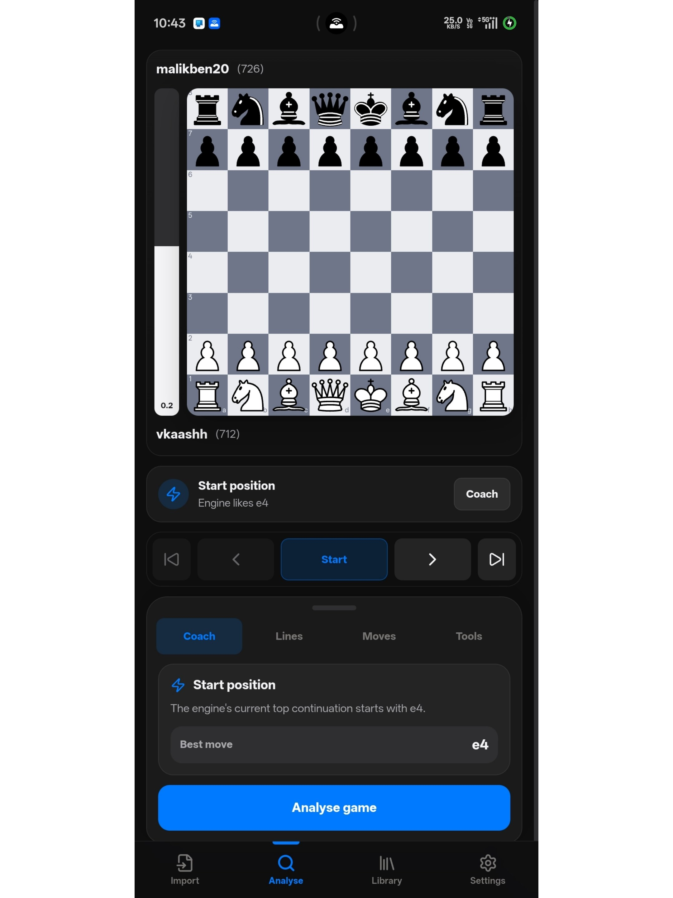
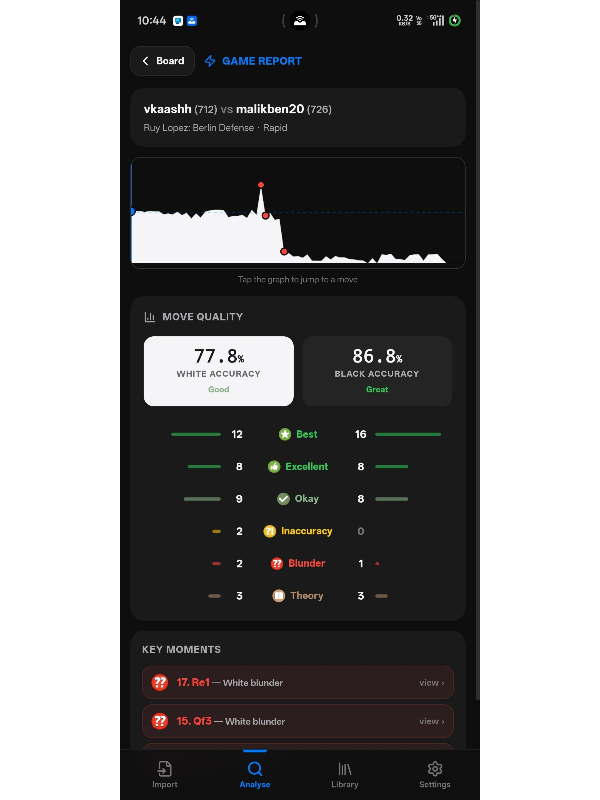
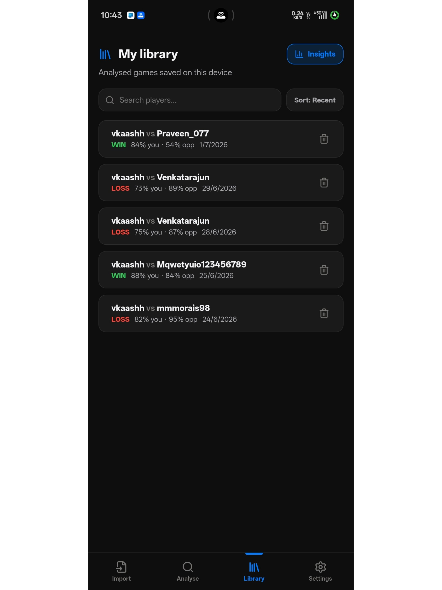
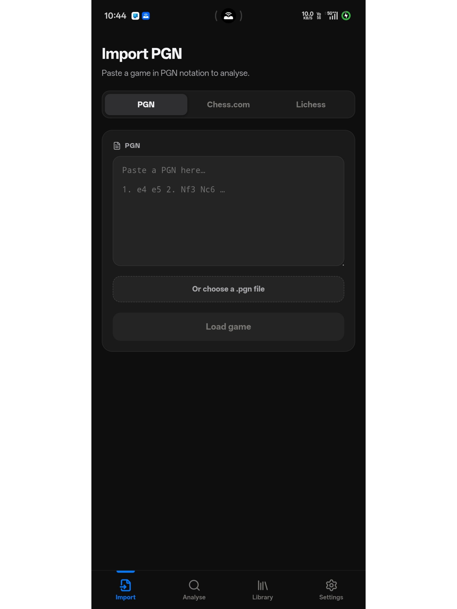
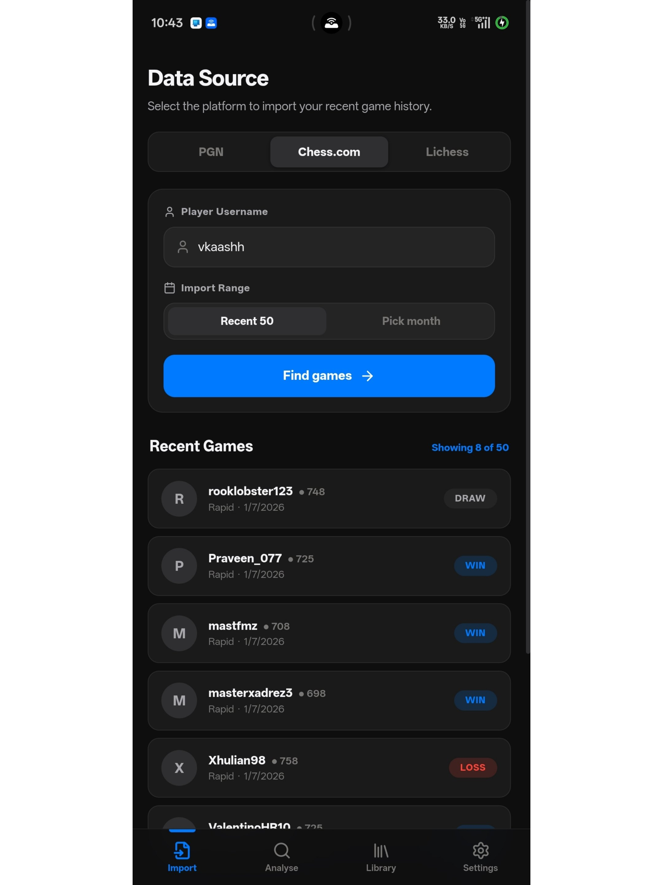
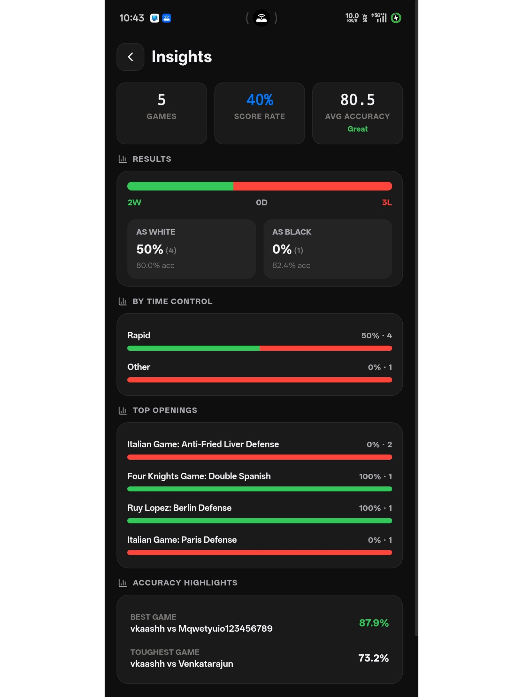

# ChessMate

ChessMate is a simple chess analysis app that runs on your device. Import a game, run Stockfish, review the important moments, and save the analysis locally.

No accounts. No tracking. No server-side analysis. Your games stay on your phone/browser unless you choose to share or export them.

---

## What it looks like

<p align="center">
  
  
  
</p>

<p align="center">
  
  
  
</p>

---

## Features

- **On-device Stockfish analysis** using Stockfish 17 WASM.
- **Game Review style feedback** with move labels like Best, Excellent, Inaccuracy, Mistake, Blunder, Theory, Brilliant, and more.
- **Accuracy scores** for both players.
- **Engine lines and evaluation bar** while exploring positions.
- **Move-by-move review** with a cleaner coach-style analysis panel.
- **Import games** from:
  - pasted PGN
  - `.pgn` file
  - Chess.com username
  - Lichess username
- **Local library** for saved analysed games.
- **Insights page** with score rate, accuracy, openings, time controls, and best/worst games.
- **Share/export** current FEN or PGN with variations.
- **PWA + Android support** through Capacitor.

---

## How it works

1. Import a game from PGN, Chess.com, or Lichess.
2. ChessMate builds the move tree in the browser.
3. Stockfish evaluates the positions locally.
4. The app classifies each move and calculates accuracy.
5. You can save the analysed game to the local library.

Saved games and cached engine evaluations are stored on the device with IndexedDB.

---

## Tech stack

- React 18
- TypeScript
- Vite
- Zustand
- chess.js
- react-chessboard
- Stockfish 17 WASM
- IndexedDB via idb-keyval
- Capacitor for Android builds

---

## Run locally

Requirements:

- Node.js 22+ recommended
- npm

```bash
git clone https://github.com/vkas-h/ChessMate.git
cd ChessMate
npm install
npm run dev
```

Open the local URL printed by Vite.

For testing on a phone over the same Wi-Fi:

```bash
npm run dev -- --host
```

---

## Build

```bash
npm test
npm run build
```

The production web build is generated in:

```txt
dist/
```

---

## Android APK

ChessMate uses Capacitor for Android.

```bash
npm run android:sync
npm run android:open
```

Then build the APK from Android Studio:

```txt
Build → Build Bundle(s) / APK(s) → Build APK(s)
```

Debug APK output is usually here:

```txt
android/app/build/outputs/apk/debug/app-debug.apk
```

For release builds, use Android Studio’s signed APK flow.

---

## Versioning

Update both places before making a release:

### App version shown inside ChessMate

```txt
package.json
```

```json
"version": "1.2.1"
```

### Android APK version

```txt
android/app/build.gradle
```

```gradle
versionCode 13
versionName "1.2.1"
```

`versionCode` must increase for every Android release.

---

## Project structure

```txt
src/
├── components/       shared UI components
├── screens/          main app screens
├── engine/           Stockfish wrapper, analysis pipeline, eval cache
├── lib/              importers, library storage, settings, stats, reports
├── core/             chess analysis core, move classification, types
├── store.ts          global app state
└── main.tsx          app entry
```

---

## Privacy

ChessMate is designed to be private by default.

- No sign-in required.
- No analytics.
- No ads.
- No server-side game storage.
- Stockfish runs locally in the app.
- Saved games stay in your browser/app storage.

Network access is only used when you import games from Chess.com/Lichess or request cloud evaluation data when enabled.

---

## Credits

ChessMate includes analysis logic derived from [WintrChess](https://github.com/wintrcat/wintrchess), and uses Stockfish for engine evaluation.

---

## License

GPL-3.0. See [LICENSE](LICENSE).
